# Kế hoạch Triển khai 10 Tuần (10-Week Roadmap) — Dự án LUCY

Tài liệu này chi tiết hóa lộ trình phát triển và tích hợp hệ thống **LUCY (Language Unity & Collaborative Youth)** trong vòng 10 tuần, phân chia rõ vai trò và công việc giữa các nền tảng kỹ thuật: **Java**, **.NET**, **Node.js**, **Mobile App**, và **Testing**.

---

## 📊 Biểu đồ Lộ trình Tổng thể (Gantt Chart)

```mermaid
gantt
    title Lộ trình Phát triển Dự án LUCY (10 Tuần)
    dateFormat W
    axisFormat Tuần %V

    section Tuần 1-2: Nền tảng & Data
    Java - Import DOCX & API Level       :active, j1, 0, 2w
    .NET - Login/Register & Auth         :active, n1, 0, 2w
    Mobile - UI Kit & Luồng Màn hình      :active, m1, 0, 2w

    section Tuần 3-5: MVP Real-time Audio
    Node.js - Tích hợp Agora SDK         :a1, after j1, 3w
    Mobile - Kết nối Audio & Mic/RaiseHand:a2, after m1, 3w
    Testing - Thử nghiệm Phòng Ẩn danh    :a3, after a1, 3w

    section Tuần 6-7: LMS & Pro Tools
    Java - Ghim Slide/Tài liệu           :l1, after a1, 2w
    Node.js - Stage Transition Logic     :l2, after a1, 2w
    Mobile - Dashboard Pro & Mentor      :l3, after a2, 2w

    section Tuần 8-9: Monetization & Podcast
    .NET - Ví, Nạp tiền, Tặng quà        :m2, after l2, 2w
    Node.js - Ghi âm Audio (Super Account) :m3, after l2, 2w
    Mobile - Podcast & Hiệu ứng Quà      :m4, after l3, 2w

    section Tuần 10: Tối ưu & Launch
    QA - Stress Test (500-1000 Users)   :t1, after m2, 1w
    Bug Fix - UI/UX & Độ trễ âm thanh   :t2, after m2, 1w
    Release - Bản Beta                  :milestone, after t2, 0d
```

---

## 🗓️ Chi tiết Kế hoạch theo Tuần

### 🔹 Tuần 1 - 2: Thiết lập Nền tảng & Dữ liệu (Foundation & Data)
*Tập trung xây dựng cấu trúc dữ liệu cốt lõi, cơ chế xác thực người dùng và nền tảng giao diện ứng dụng di động.*

*   **☕ Java (Spring Boot)**:
    *   Xây dựng logic import dữ liệu tự động cho **100 levels** học tập từ tệp `.docx` (sử dụng Apache POI) vào cơ sở dữ liệu.
    *   Thiết kế và phát triển RESTful API để truy xuất nội dung học tập theo từng Level/Chapter/Lesson phục vụ cho Mobile và Web.
*   **🌐 .NET (Web API)**:
    *   Thiết lập dự án Identity Service: Xây dựng hệ thống Đăng ký (Register), Đăng nhập (Login) sử dụng JWT.
    *   Phân quyền người dùng chi tiết cho 3 loại tài khoản chính: **Learner (Học viên)**, **Pro Mentor (Người hướng dẫn chuyên nghiệp)**, và **Super Creator (Người sáng tạo nội dung)**.
*   **📱 Mobile (React Native / Flutter)**:
    *   Thiết kế và hoàn thiện bộ **UI Kit** chuẩn (màu sắc, typography, component tái sử dụng).
    *   Xây dựng luồng luân chuyển màn hình (Navigation Flow) cơ bản (Splash, Auth, Home, Profile, Room List).

---

### 🔹 Tuần 3 - 5: MVP Real-time Audio (Minimum Viable Product)
*Mục tiêu chính là thiết lập kết nối âm thanh thời gian thực đa người dùng trong phòng trò chuyện.*

*   **🟢 Node.js (Real-time Service)**:
    *   Tích hợp **Agora WebRTC SDK** để quản lý luồng âm thanh thời gian thực (Audio Streaming) giữa nhiều người dùng trong phòng.
    *   Quản lý danh sách phòng hoạt động và đồng bộ trạng thái kết nối.
*   **📱 Mobile (Audio Integration)**:
    *   Kết nối API Audio của Agora vào ứng dụng.
    *   Phát triển các tính năng tương tác trực tiếp trong phòng: **Bật/Tắt Mic**, **Giơ tay phát biểu (Raise Hand)**, và **Duyệt phát biểu** bởi Host/Moderator.
*   **🧪 Testing & Verification**:
    *   Thực hiện thử nghiệm phòng ẩn danh (Anonymous Speaking Rooms) đầu tiên cho các nhóm từ **Level 1 đến Level 5** (Survival Speaking) nhằm đánh giá độ trễ và khả năng kết nối.

---

### 🔹 Tuần 6 - 7: Công cụ LMS cho Pro (LMS Tools for Professional Mentors)
*Cung cấp các công cụ giảng dạy nâng cao và quản lý học tập thời gian thực trong phòng.*

*   **☕ Java (Spring Boot)**:
    *   Hoàn thiện tính năng quản lý tài liệu: Cho phép Pro Mentor ghim (pin) Slide bài giảng, hình ảnh, tài liệu học tập trực tiếp vào phòng học trực tuyến.
*   **🟢 Node.js (Stage Transition Logic)**:
    *   Xây dựng logic tự động chuyển đổi giai đoạn (**Stage Transition**). Hệ thống tự động nhảy sang chủ đề thảo luận tiếp theo sau mỗi 10 phút để tối ưu hóa thời gian phòng.
*   **📱 Mobile (Mentor Dashboard)**:
    *   Phát triển giao diện Dashboard dành riêng cho tài khoản Pro Mentor để quản lý danh sách học viên, bật/tắt tiếng học viên, ghim tài liệu lên màn hình học viên.

---

### 🔹 Tuần 8 - 9: Monetization & Podcast (Thương mại hóa & Nội dung số)
*Tích hợp tính năng ví điện tử, hệ thống quà tặng thời gian thực và phát hành Podcast.*

*   **🌐 .NET (Web API - Billing Service)**:
    *   Xây dựng hệ thống Ví ảo (Mock Wallet) tích hợp cổng nạp tiền (Sandbox) cho người dùng.
    *   Thiết kế API hỗ trợ tính năng tặng quà Real-time (Virtual Gifts như Star ⭐, Coffee ☕, Diamond 💎) trong phòng học.
*   **🟢 Node.js (Audio Recording)**:
    *   Phát triển tính năng lưu trữ luồng âm thanh phòng học (Audio Recording/Archiving) dành riêng cho các tài khoản Super Creator để chuyển đổi phòng trò chuyện thành Podcast.
*   **📱 Mobile (Podcast & Gift Effects)**:
    *   Phát triển giao diện nghe lại các số Podcast đã phát hành.
    *   Xây dựng hiệu ứng hình ảnh sinh động (Animation Effects) khi người dùng tặng quà thời gian thực trong phòng.

---

### 🔹 Tuần 10: Tối ưu hóa & Phát hành (Optimization & Launch)
*Đảm bảo hệ thống vận hành trơn tru ở quy mô lớn và chuẩn bị ra mắt phiên bản thử nghiệm.*

*   **🧪 Stress Test (Kiểm thử hiệu năng)**:
    *   Thực hiện giả lập tải và stress test hệ thống backend (Java, .NET, Node.js) để đảm bảo khả năng xử lý đồng thời từ **500 đến 1000 người dùng trực tuyến** (concurrent users).
*   **🛠️ Fix Bugs & Tối ưu hóa**:
    *   Tinh chỉnh giao diện UI/UX dựa trên phản hồi thử nghiệm.
    *   Tối ưu hóa băng thông, giảm thiểu độ trễ âm thanh Agora trên thiết bị di động.
*   **🚀 Release**:
    *   Đóng gói ứng dụng di động và backend để phát hành bản **Beta Release** phục vụ nhóm người dùng thử nghiệm giới hạn.

---

## 🛠️ Ma trận Trách nhiệm Công việc (Responsibility Matrix)

| Hạng mục / Công việc | Java | .NET | Node.js | Mobile | QA/Test |
| :--- | :---: | :---: | :---: | :---: | :---: |
| Import DOCX & API Level | 🟢 | | | | |
| Hệ thống Auth & Phân quyền | | 🟢 | | | |
| UI Kit & Navigation Flow | | | | 🟢 | |
| Tích hợp Agora SDK (Audio) | | | 🟢 | 🟢 | |
| Tính năng Mic / Giơ tay | | | | 🟢 | |
| Test Phòng Ẩn danh | | | | 🟢 | 🟢 |
| Ghim Slide/Tài liệu phòng | 🟢 | | | 🟢 | |
| Logic chuyển Stage 10 phút | | | 🟢 | | |
| Dashboard Quản lý cho Pro | | | | 🟢 | |
| Ví ảo, Nạp tiền, Tặng quà | | 🟢 | | | |
| Ghi âm Audio (Record) | | | 🟢 | | |
| Nghe lại Podcast & Hiệu ứng Quà | | | | 🟢 | |
| Stress test (500-1000 users) | 🟢 | 🟢 | 🟢 | | 🟢 |
| Khắc phục độ trễ & Ra mắt Beta | 🟢 | 🟢 | 🟢 | 🟢 | 🟢 |
